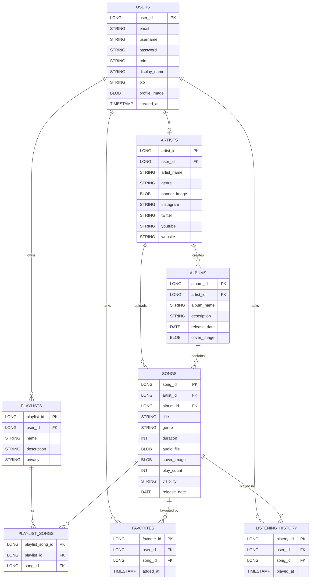

# 🎵 RevPlay — Music Streaming Application

> **⚠️ WARNING FOR TEAM MEMBERS:**
> Do **NOT** change the database connection details in your local `application.properties`. Your local config must match the shared team configuration exactly. Changing the DB credentials will break your connection to the shared Oracle database.

RevPlay is a full-stack music streaming web application built with **Spring Boot**, **Thymeleaf**, and an **Oracle Database**. It allows listeners to discover and play music, and artists to manage and upload their content.

---

## 🚀 Tech Stack

| Layer | Technology |
|---|---|
| **Backend** | Java 17, Spring Boot 3.x |
| **Security** | Spring Security 6 |
| **ORM** | Spring Data JPA / Hibernate |
| **Templating** | Thymeleaf + Thymeleaf Spring Security Extras |
| **Database** | Oracle Database (via OJDBC 11) |
| **Frontend** | Bootstrap 5.3, Vanilla CSS, JavaScript |
| **Build Tool** | Maven (Maven Wrapper included) |

---

## ⚙️ Prerequisites

Before running the application, make sure you have:

- **Java 17+** installed (JDK 17 or JDK 21 recommended)
- **Maven** or use the included `./mvnw` wrapper
- Access to the shared **Oracle Database** (credentials in `application.properties`)

---

## 🏃 Running the Application

```bash
# Using the Maven Wrapper (recommended)
./mvnw spring-boot:run

# If JAVA_HOME is not set to Java 17+, override it:
$env:JAVA_HOME = 'C:\Program Files\Java\jdk-21'; ./mvnw spring-boot:run
```

The application will start at: **http://localhost:8080**

> You will be redirected to the Login page immediately. Register an account to get started.

---

## 📁 Project Structure

```
src/
├── main/
│   ├── java/com/revature/revplay/
│   │   ├── config/          # Spring Security configuration
│   │   ├── controller/      # MVC Controllers
│   │   ├── customexceptions/# Global exception handlers & custom classes
│   │   ├── model/           # JPA Entity classes
│   │   ├── repository/      # Spring Data JPA Repositories
│   │   ├── service/         # Business logic services
│   │   └── utils/           # Utility classes (e.g. Base64Util)
│   └── resources/
│       ├── static/css/      # Global stylesheet (style.css)
│       ├── static/images/   # Static assets
│       └── templates/       # Thymeleaf HTML templates
```

---

## 🗃️ Database ERD



---

## 👥 Team & User Stories

### 👨‍💻 Person 1 — Authentication & Basic Profile + Basic Discovery ✅

**As a User (Listener), I should be able to:**
- ✅ Register and create an account with email, username, and password
- ✅ Login to my account using email/username and password
- ✅ View and edit my profile (display name, bio, profile picture)

**As a Musician/Artist, I should be able to:**
- ✅ Register as an artist with email, password, and artist details
- ✅ Login to my account
- ✅ Create and manage artist profile (artist name, bio, genre, profile picture)

**Music Discovery:**
- ✅ Browse music library with all available songs
- [ ] View song details (title, artist, album, duration, genre, release date)

---

### 👨‍💻 Person 2 — Search, Categories & Artist/Album Views

**As a User (Listener), I should be able to:**
- [ ] Search for songs, artists, albums, and playlists by keywords
- [ ] Browse content by categories (genre, artist, album)
- [ ] Filter songs by genre, artist, album, or release year

**Artist & Album Views:**
- [ ] View artist profiles with their songs and albums
- [ ] View album details with track list

**As a Musician/Artist, I should be able to:**
- [ ] View my artist profile as users see it
- ✅ Add social media links (Instagram, X, YouTube, Website)

---

### 👨‍💻 Person 3 — Music Player & Playback Queue

**As a User (Listener), I should be able to:**
- [ ] Play songs using integrated web music player
- [ ] Use player controls (play, pause, skip forward, skip backward, seek)
- [ ] View currently playing song with progress bar
- [ ] Create and manage playback queue
- [ ] Enable repeat mode (off, repeat one, repeat all)
- [ ] Enable shuffle mode
- [ ] Adjust volume control

**Listening History:**
- [ ] View recently played songs (last 50 songs)
- [ ] View complete listening history with date and time
- [ ] Clear listening history

---

### 👨‍💻 Person 4 — Favorites & Playlist Management

**As a User (Listener), I should be able to:**
- [ ] Mark songs as favorites
- [ ] Remove songs from favorites
- [ ] View all my favorite songs
- [ ] Quick access to favorite songs from player

**Playlist Management:**
- [ ] Create playlists with name and description
- [ ] Set playlist privacy (public or private)
- [ ] Add songs to my playlists
- [ ] Remove songs from my playlists
- [ ] Reorder songs in playlists
- [ ] Update playlist details (name, description, privacy)
- [ ] Delete playlists created by me
- [ ] View all my playlists
- [ ] View public playlists created by other users
- [ ] Follow/unfollow public playlists

---

### 👨‍💻 Person 5 — Artist Upload & Analytics + Account Stats

**As a Musician/Artist, I should be able to:**
- [ ] Upload songs with details (title, genre, duration, audio file)
- [ ] Upload album artwork/cover image
- [ ] Create albums with name, description, release date, and cover art
- [ ] Add songs to albums
- [ ] Remove songs from albums
- [ ] View all my uploaded songs
- [ ] View all my created albums
- [ ] Update song information (title, genre, album)
- [ ] Update album information (name, description, cover art)
- [ ] Delete my songs
- [ ] Delete my albums (if no songs are in the album)
- [ ] Set song visibility (public/unlisted)

**Analytics & Insights:**
- [ ] View dashboard with key metrics (total songs, total plays, total favorites)
- [ ] View play count for individual songs
- [ ] View songs sorted by popularity (most played)
- [ ] View list of users who favorited my songs
- [ ] View listening trends over time (daily/weekly/monthly plays)
- [ ] View top listeners (users who played my songs the most)

**Account Statistics:**
- [ ] View my account statistics (total playlists, favorite songs count, listening time)

---

## 🔐 Roles

| Role | Access |
|---|---|
| `SUBSCRIBER` | Browse music, manage profile, playlists, favorites, listening history |
| `ARTIST` | All subscriber features + Artist Studio (upload, manage songs/albums, analytics) |

---

## 📝 Technical Notes & Polish

- **Performance:** Replaced external Google Fonts with system-standard **Trebuchet MS** to eliminate blocking CDN requests and improve load times.
- **Error Handling:** Implemented a **Global Exception Handling** system with custom exceptions (`ResourceNotFoundException`, `UserAlreadyExistsException`, `InvalidFileException`) and a thematic error return page.
- **Code Health:** Performed a full project refactor, removing unused CSS, dead directory structures, and orphaned service methods.
- **UI Consistency:** Custom-styled all form elements (dropdowns, inputs) with an orange/snow design system, ensuring a premium "wow" factor across all pages.
- **Data URIs:** Profile and banner images are served as Base64 Data URIs directly from the Oracle BLOB store to minimize complex file system management.
- **Security:** Spring Security 6 integration using modern lambda-based DSL and role-based access control.
