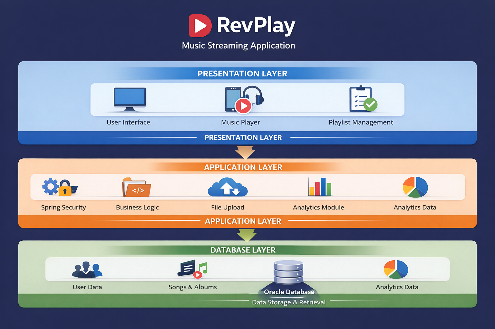
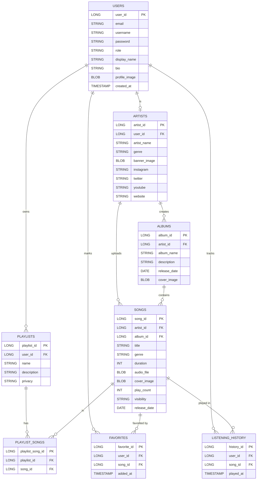

# 🎵 RevPlay - Enterprise Music Management System

RevPlay is a comprehensive, enterprise-grade full-stack music streaming web application built with **Spring Boot**, **Thymeleaf**, and an **Oracle Database**. Built on the **N-Tier Architecture** pattern, it provides a feature-rich, high-performance web environment for listeners to discover and play music, and for artists to manage and upload their content.

---

## 📊 Entity Relationship Diagram (ERD)

<p align="center">
  
</p>

📌 This ERD represents all core entities such as Users, Artists, Albums, Songs, Playlists, Favorites, and Listening History along with their relationships, primary keys, and foreign key constraints.

## 🏛 Application Architecture (N-Tier / Layered Design)

<p align="center">
  
</p>

📌 The diagram illustrates the complete modular architecture of RevPlay:
- **Presentation Layer**: Thymeleaf templates, Bootstrap 5.3, Vanilla CSS, and JavaScript.
- **Controller/Web Layer**: MVC Web Controllers and REST API Endpoints.
- **Service Layer**: Business logic, validation, and orchestration.
- **DAO/Repository Layer**: Spring Data JPA Repositories for data access.
- **Model/Entity Layer**: JPA Entity classes modeling the database tables.
- **Database Layer**: Oracle Database (via OJDBC 11) for persistent storage.

---

## 🚀 Tech Stack

| Layer | Technology |
|---|---|
| **Backend** | Java 17, Spring Boot 3.x |
| **Security** | Spring Security 6 |
| **ORM** | Spring Data JPA / Hibernate |
| **Templating** | Thymeleaf + Thymeleaf Spring Security Extras |
| **Database** | Oracle Database (via OJDBC 11) |
| **Frontend** | Bootstrap 5.3, Vanilla CSS, JavaScript |
| **Build Tool** | Maven (Maven Wrapper included) |

---

## ⚙️ Prerequisites

Before running the application, make sure you have:

- **Java 17+** installed (JDK 17 or JDK 21 recommended)
- **Maven** or use the included `./mvnw` wrapper
- Access to the shared **Oracle Database** (credentials in `application.properties`)

---

## 🏃 Running the Application

```bash
# Using the Maven Wrapper to run the application
./mvnw spring-boot:run

# If JAVA_HOME is not set to Java 17+, override it:
$env:JAVA_HOME = 'C:\Program Files\Java\jdk-21'; ./mvnw spring-boot:run
```

The application will start at: **http://localhost:8080**

### 🧪 Testing & Code Quality

#### Running Tests
RevPlay uses **JUnit 5** and **Mockito 5** for robust testing logic.
```bash
# Run all automated tests
./mvnw test
```

#### Code Coverage (JaCoCo)
After running tests, a detailed coverage report is generated:
```bash
# Generate a JaCoCo code coverage report
./mvnw clean test jacoco:report
```
- **Report Location**: `target/site/jacoco/index.html`
- Open this file in any web browser to view detailed coverage metrics.

---

## 🏗 Project Structure

```text
src/
├── main/
│   ├── java/com/revature/revplay/
│   │   ├── config/          # Spring Security, Web, and general configurations
│   │   ├── controller/      # MVC Web Controllers and REST API Endpoints
│   │   ├── dto/             # Data Transfer Objects for forms & API responses
│   │   ├── entity/          # JPA Entity classes modeling the database tables
│   │   ├── exception/       # Global exception handlers & custom error classes
│   │   ├── repository/      # Spring Data JPA Repositories for data access
│   │   └── service/         # Business logic services and their implementations
│   └── resources/
│       ├── scripts/         # SQL initialization scripts and database setup
│       ├── static/          # Global assets (CSS, JS, images)
│       ├── templates/       # Thymeleaf HTML templates (UI views)
│       ├── application.properties # Main application configuration
│       └── log4j2.xml       # Externalized logging configurations
└── test/
    └── java/com/revature/revplay/
        └── service/         # JUnit & Mockito test classes for service layer
```

---

## 📂 Project Documentation & Resources

- 📘 **Application Documentation**  
  👉 [revplay_app_documentation.docx](documentation/revplay_app_documentation.docx)

- 🗄️ **Database ERD (PNG)**  
  👉 [RevPlay_app_ERD.png](documentation/RevPlay_app_ERD.png)

- 📊 **Project Presentation**  
  👉 [RevPlay-presentation.pptx](documentation/RevPlay-presentation.pptx)

- 🏛 **Architecture Diagram**  
  👉 [Architecture_diagram.png](documentation/Architecture_diagram.png)

---

## ✨ Enterprise Features
- **Global Exception Handling**: Custom exceptions with a thematic error return page.
- **Data URIs**: Profile and banner images are served as Base64 Data URIs directly from the Oracle BLOB store to minimize complex file system management.
- **Role-Based Security**: Spring Security 6 integration using modern lambda-based DSL (`SUBSCRIBER`, `ARTIST`).
- **Logging**: Integrated **Log4j2** for diagnostics, analytics, and capturing application events in console and persistent log files.

---

## 👥 About the Team & User Stories

Created with ❤️ by the **RevPlay Team** (Manjunath, Neha, Ramya, Indraja, Pooja).
*A showcase of clean code, architectural best practices, and enterprise system design.*

### 👨‍💻 Manjunath (Person 1) — Authentication & Basic Profile ✅
- ✅ Register and create an account with email, username, and password
- ✅ Login to my account using username and password
- ✅ View and edit my profile (display name, bio, profile picture)
- ✅ Register as an artist with email, password, and artist details
- ✅ Create and manage artist profile (artist name, bio, genre, profile picture)
- ✅ Browse music library and view song details
- ✅ Implement system-wide Log4j2 logging

### 👩‍💻 Neha (Person 2) — Search, Categories & Artist/Album Views ✅
- ✅ Search for songs, artists, albums, and playlists by keywords
- ✅ Browse content by categories (genre, artist, album)
- ✅ Filter songs by genre, artist, album, or release year
- ✅ View artist profiles with their songs and albums
- ✅ View album details with track list
- ✅ Add social media links (Instagram, X, YouTube, Website)

### 👩‍💻 Ramya (Person 3) — Music Player & Playback Queue ✅
- ✅ Play songs using integrated web music player with external controls
- ✅ View currently playing song with progress bar
- ✅ Create and manage playback queue
- ✅ Enable repeat mode (off, repeat one, repeat all) and shuffle
- ✅ View recently played songs and complete listening history
- ✅ Clear listening history

### 👩‍💻 Indraja (Person 4) — Favorites & Playlist Management ✅
- ✅ Mark songs as favorites, remove, and view favorites
- ✅ Create playlists with name, description, and privacy settings
- ✅ Add/remove songs and reorder songs in playlists
- ✅ Update and delete playlists created by me
- ✅ View public playlists created by other users and follow them

### 👩‍💻 Pooja (Person 5) — Artist Upload & Analytics + Account Stats ✅
- ✅ Upload songs with details and cover art
- ✅ Create albums and add/remove songs
- ✅ View all uploaded songs and created albums
- ✅ Update or delete song and album information
- ✅ View dashboard with key metrics (total songs, total plays, total favorites)
- ✅ View listening trends over time and top listeners
- ✅ View account statistics (total playlists, favorite songs, listening time)

---

## 🏗 Coding Representation (ERD)


```mermaid
erDiagram
    USERS {
        LONG user_id PK
        STRING email
        STRING username
        STRING password
        STRING role
        STRING display_name
        STRING bio
        BLOB profile_image
        TIMESTAMP created_at
    }
    ARTISTS {
        LONG artist_id PK
        LONG user_id FK
        STRING artist_name
        STRING genre
        BLOB banner_image
        STRING instagram
        STRING twitter
        STRING youtube
        STRING website
    }
    SONGS {
        LONG song_id PK
        LONG artist_id FK
        LONG album_id FK
        STRING title
        STRING genre
        INT duration
        BLOB audio_file
        BLOB cover_image
        INT play_count
        STRING visibility
        DATE release_date
    }
    ALBUMS {
        LONG album_id PK
        LONG artist_id FK
        STRING album_name
        STRING description
        DATE release_date
        BLOB cover_image
    }
    PLAYLISTS {
        LONG playlist_id PK
        LONG user_id FK
        STRING name
        STRING description
        STRING privacy
    }
    PLAYLIST_SONGS {
        LONG playlist_song_id PK
        LONG playlist_id FK
        LONG song_id FK
    }
    FAVORITES {
        LONG favorite_id PK
        LONG user_id FK
        LONG song_id FK
        TIMESTAMP added_at
    }
    LISTENING_HISTORY {
        LONG history_id PK
        LONG user_id FK
        LONG song_id FK
        TIMESTAMP played_at
    }

    USERS ||--o| ARTISTS : "is"
    ARTISTS ||--o{ SONGS : "uploads"
    ARTISTS ||--o{ ALBUMS : "creates"
    ALBUMS ||--o{ SONGS : "contains"
    USERS ||--o{ PLAYLISTS : "owns"
    PLAYLISTS ||--o{ PLAYLIST_SONGS : "has"
    SONGS ||--o{ PLAYLIST_SONGS : "in"
    USERS ||--o{ FAVORITES : "marks"
    SONGS ||--o{ FAVORITES : "favorited by"
    USERS ||--o{ LISTENING_HISTORY : "tracks"
    SONGS ||--o{ LISTENING_HISTORY : "played in"
```